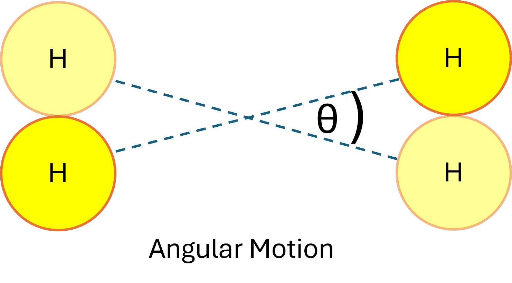
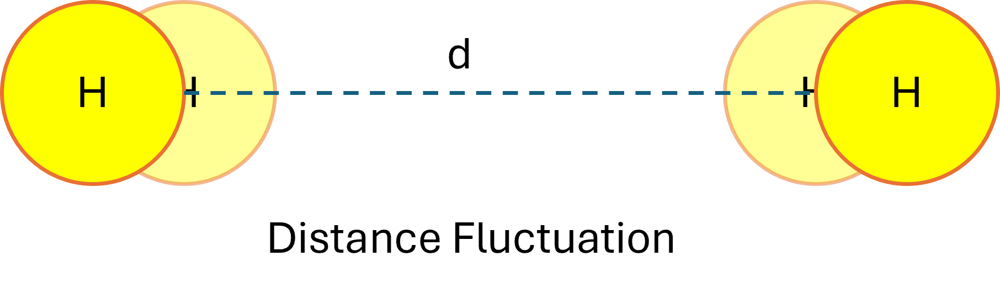
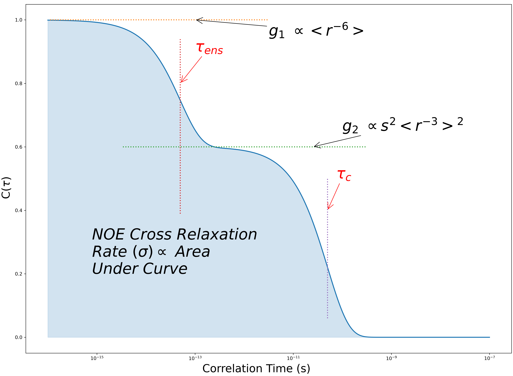
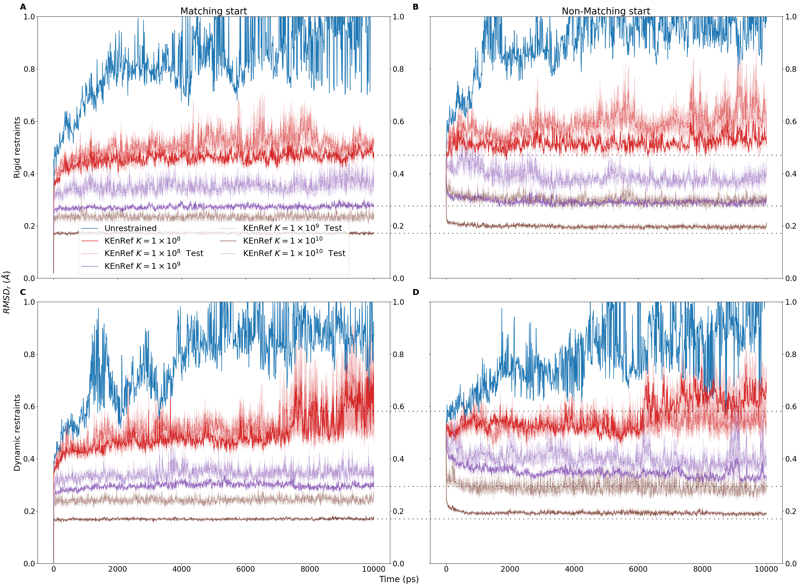
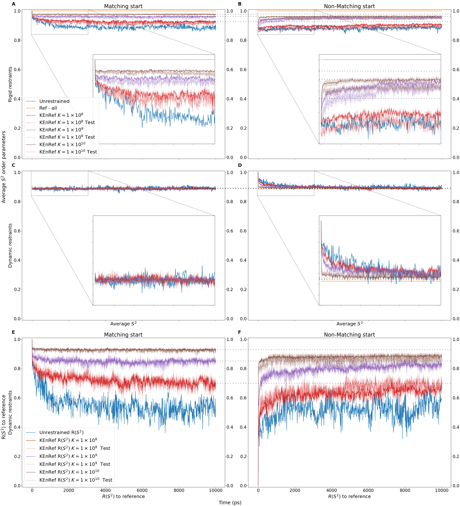
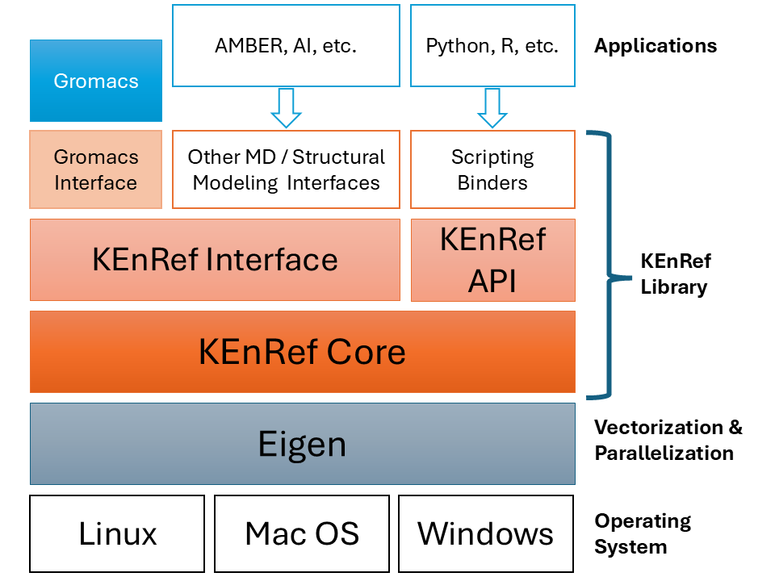

# Kinetic Ensemble Refinement
This repository contains the code of the KEnRef (_Kinetic Ensemble Refinement_) library. 

**KEnREf** is developed as a stand-alone high-performance C++ library with interface(s) to interact with the major molecular modeling software packages. Currently, **Gromacs** only is supported.

Click [here](https://smithlab.research.wesleyan.edu/research/) to go to Smith lab for more information.

## Why KEnRef
KEnRef unique advantage relative to all previous methods, is that it accounts for the effects of **_angular_** motion, not only the interactomic **_distances_** .

| Angular Motion                                                           | Distance Fluctuation                                    |
|--------------------------------------------------------------------------|---------------------------------------------------------|
|  |  |

## How it works
NOE Cross Relaxation Rate value $\sigma$ is used to derive the restraint energy from the simulation.

## Is it reliable?

### Average Structure Accuracy
RMSDr of the $r^{-6}$ averaged distances shows gradual decrease with higher force constants.

The higher the K:
- the lower the $RMSDr$,
- the greater the gap between each _restrained_ subset and its related _test_ subset, starting with a small gap in case of $K=10^8$.

### Angular Dynamics

- **Rigid restraints**: KEnRef achieved high overall angular order with average $S2$ of 0.97 (matching start) and 0.95 (non-matching start) vs. average $S2$ of 0.85 for unrestrained simulations.
- **Dynamic restraints**: Target average $S2$ was close to the unrestrained simulations. All simulations started from the dynamic ensemble stay at order parameters ~ 0.85.  KEnRef simulations converge faster than the unrestrained simulations, with the speed of convergence increasing with the $K$ force constant.
- Correlation function plateau values are sufficient to produce ensembles that match the overall angular motion of a structural ensemble used to produce that data.

### Distance Dynamics

- Average standard deviation of interatomic distances \[Average $\sigma(r)$], represents the overall amount of distance dynamics in the ensemble.
- Correlation coefficient between the restrained simulations and the reference, \[$R(\sigma(r))$], indicates whether atomic fluctuations are located in the correct parts of the structure.

The higher the $K$,
- the closer and faster the simulations stick to, or go to the reference average values of 0.0 Å (rigid simulations) or ≈ 0.38 Å (dynamic simulations),
- the more correlated the simulations are to the reference.

Test sets monotonically improve with increasing $K$, although the gap between each restrained and its test set widens.

_for_N=.25_MAX=800.png)

## KEnRef Structure
KenRef can be installed on top of Eigen, which itself is a cross-platform framework with implementations for Windows, Linux, and Mac OS.

## Requirements
1. C++17 enabled compiler
2. Eigen C++ library
3. A recent CMake
4. Gromacs is required to install **KEnRef-Gromacs Bridge**

